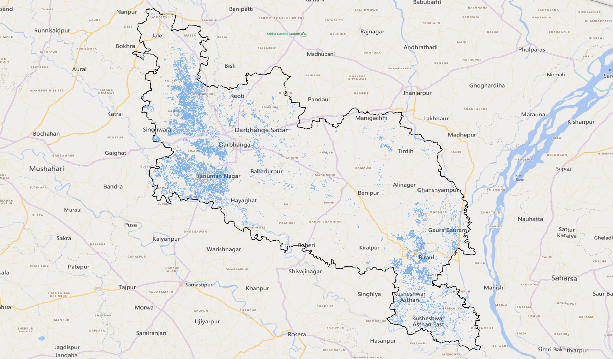

# 🌊 Automated Sentinel-1 SAR Flood Mapping (Google Earth Engine)

This project provides a complete workflow for automated flood detection and surface water mapping using **Sentinel-1 Synthetic Aperture Radar (SAR)** imagery in Google Earth Engine (GEE). 

SAR imagery is uniquely suited for flood monitoring during monsoon conditions because radar signals penetrate cloud cover and operate independently of day/night cycles.

---

## 📌 Project Highlights
* **Satellite Data:** Sentinel-1 Ground Range Detected (GRD), C-band SAR.
* **Polarization:** VV (Vertical Transmit / Vertical Receive).
* **Region of Interest:** Darbhanga District, Bihar, India.
* **Pre-Flood Period:** June 2025 (Baseline dry/pre-monsoon state).
* **Post-Flood Period:** August 2025 (Peak monsoon state).

---

## 🛠️ Methodology & Workflow

1. **Data Ingestion & Filtering:** Filter Sentinel-1 collection by region of interest, date range, transmitter polarisation (`VV`), and IW mode.
2. **Speckle Reduction:** Apply spatial focal mean filtering (`focal_mean`) to minimize radar speckle noise.
3. **Change Detection:** Calculate difference/ratio between pre-flood and post-flood backscatter images ($\text{Pre} / \text{Post}$).
4. **Flood Thresholding:** Isolate newly flooded areas based on backscatter reduction thresholds.
5. **False-Positive Removal:** 
   * Mask out permanent water bodies using JRC Global Surface Water dataset.
   * Remove high-slope terrain false positives using HydroSHEDS DEM.
6. **Area Calculation & Export:** Compute total flooded area in hectares and export the result as a GeoTIFF to Google Drive.

---
## Flood Extent Visualization

## 🚀 How to Run

1. Copy the JavaScript code from [`flood_detection_sentinel1.js`](./flood_detection_sentinel1.js).
2. Open the [Google Earth Engine Code Editor](https://code.earthengine.google.com/).
3. Paste the code into the script editor window.
4. Define your area of interest (`geometry`) or use default district bounds.
5. Click **Run**.
6. Check the **Tasks** tab on the right side to trigger the GeoTIFF export to Google Drive.

---

## 🔗 Live Interactive GEE Script
> **[Click here to open and run the script directly in GEE Code Editor](https://code.earthengine.google.com/b7f34fd4c3f390ef0964d9f1652ff1d7)**

---

## 📜 License
This repository is open-source and available under the [MIT License](LICENSE).
